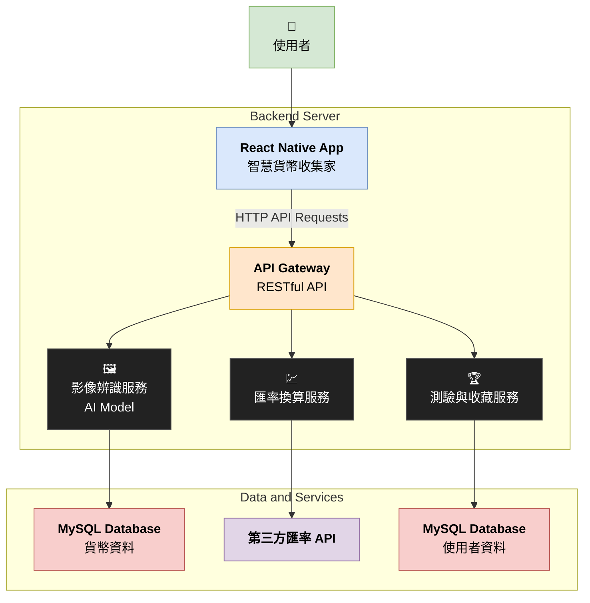

# 智慧貨幣收集家 (Smart Currency Collector)

## 成員
- 科技116 邱鈺婷 41271124H
- 科技116 盧姵帆 41271122H
- 科技116 林渝桓 41271120H

## 系統架構 (System Architecture)

本專案採用前後端分離的 Client-Server 架構。前端 App 負責使用者介面與互動，後端伺服器則負責核心業務邏輯、資料處理與 AI 辨識功能。

### | 後端服務架構圖 (Architecture Diagram)



### | 前端服務架構
```
app/
├── (tabs)/                # 這個資料夾內的頁面會共享底部導航欄
│   ├── _layout.tsx        # 這裡是設定底部導航欄的地方！
│   ├── index.tsx          # 首頁 (第一個 Tab)
│   ├── recognize.tsx      # 貨幣辨識頁 (第二個 Tab)
│   ├── converter.tsx      # 貨幣換算頁 (第三個 Tab)
│   └── collection.tsx     # 我的收藏頁 (第四個 Tab)
│
├── quiz.tsx               # 後測測驗頁 (獨立頁面)
└── _layout.tsx            # 全局的佈局設定
```

### | 元件說明 (Component Descriptions)

*   **Frontend (React Native App):**
    *   **技術棧:** React Native (with Expo)
    *   **角色:** 使用者手機上運行的應用程式，是使用者與系統互動的唯一入口。
    *   **職責:**
        1.  提供所有 UI 介面，如相機、資訊展示頁、測驗畫面等。
        2.  處理使用者操作，如拍照、點擊按鈕、輸入文字。
        3.  透過發送 HTTP API 請求與後端伺服器進行通訊，以獲取或提交資料。
        4.  管理 App 的本地狀態。

*   **Backend Server (Python Flask):**
    *   **技術棧:** Python, Flask
    *   **角色:** 專案的大腦，處理所有核心業務邏輯與資料。
    *   **職責:**
        1.  **API Gateway:** 提供一組 RESTful API 接口，供前端 App 呼叫。
        2.  **影像辨識服務:** 接收前端上傳的貨幣圖片，呼叫 AI 模型進行辨識，並回傳辨識結果。
        3.  **匯率換算服務:** 接收前端的換算請求，呼叫第三方 API 獲取即時匯率，並執行計算。
        4.  **測驗與收藏服務:** 管理使用者的測驗邏輯、計分、虛擬集幣冊與成就系統的資料存取。

*   **Database (MySQL):**
    *   **技術棧:** MySQL
    *   **角色:** 專案的永久性資料倉庫。
    *   **職責:**
        1.  **貨幣資料庫:** 儲存所有貨幣的詳細靜態資料，如名稱、國家、面額、歷史背景、文化故事等。
        2.  **使用者資料庫:** 儲存使用者帳號資訊、虛擬集幣冊內容、測驗成績與解鎖的成就。

*   **External Services:**
    *   **第三方匯率 API:** 一個外部的網路服務，提供即時、準確的全球貨幣匯率數據。後端伺服器會定時或按需向其請求資料。
