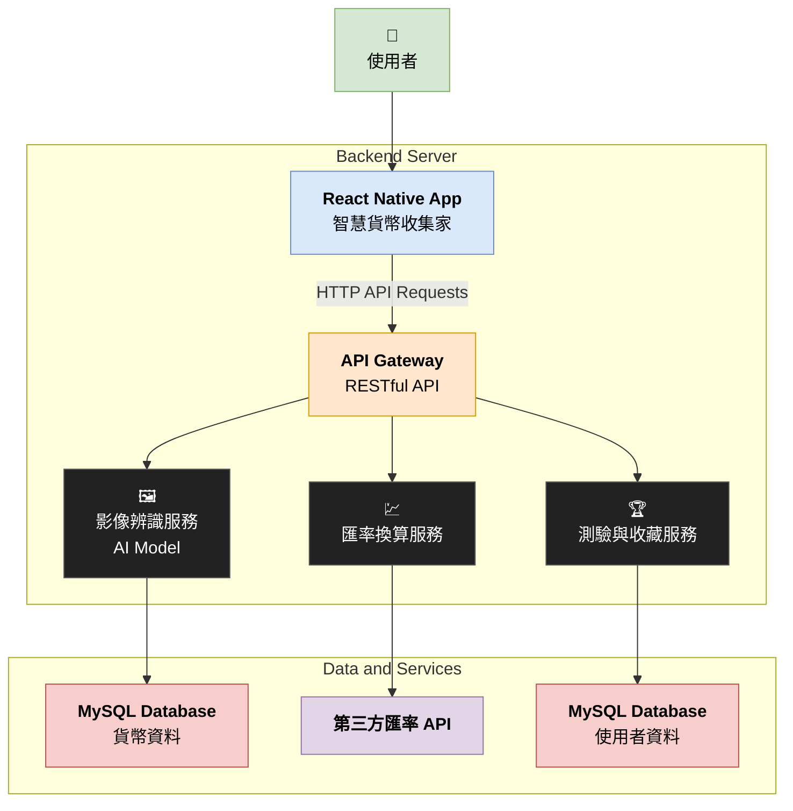

# 智慧貨幣收集家 (Smart Currency Collector)

## 成員 (第二組)
- 科技116 邱鈺婷 41271124H
- 科技116 盧姵帆 41271122H
- 科技116 林渝桓 41271120H

## 專案內容
<details>
<summary>啟動說明</summary>

### | 啟動說明
0. 目前設計改本地 IP 
    - collection.tsx
    - login.tsx
    - register.tsx
    - RatesContext.tsx
    - [code].tsx
    - recognize.tsx
    - AuthContext.tsx

    以上檔案需要:
    ```
    const API_URL = 'http://(這裡放 IP):5000';
    ```

需要同時開兩個終端機:
1. 後端
```
cd backend
venv\Scripts\activate
python app.py 
```
    
2. 前端
```
cd frontend
cd SmartCurrencyApp
npx expo start
```
</details>

<details>
<summary>系統架構</summary>

### | 系統架構 (System Architecture)

本專案採用前後端分離的 Client-Server 架構。前端 App 負責使用者介面與互動，後端伺服器則負責核心業務邏輯、資料處理與 AI 辨識功能。

### | 後端服務架構圖 (Architecture Diagram)


```mermaid
graph TD;
    User["📱<br/>使用者"] --> App["<b>React Native App</b><br/>智慧貨幣收集家"];

    subgraph "Backend Server"
        App -- "HTTP API Requests" --> API["<b>API Gateway</b><br/>RESTful API"];
        API --> ImageRecognition["🖼️<br/>影像辨識服務<br/>AI Model"];
        API --> ExchangeRate["💹<br/>匯率換算服務"];
        API --> QuizAndCollection["🏆<br/>測驗與收藏服務"];
    end

    subgraph "Data and Services"
        ImageRecognition --> DB["<b>MySQL Database</b><br/>貨幣資料"];
        ExchangeRate --> ExternalAPI["<b>第三方匯率 API</b><br/>"];
        QuizAndCollection --> UserDB["<b>MySQL Database</b><br/>使用者資料"];
    end

    classDef darkText color:#000000;
    class User,App,API,DB,UserDB,ExternalAPI darkText;

    style User fill:#D5E8D4,stroke:#82B366
    style App fill:#DAE8FC,stroke:#6C8EBF
    style API fill:#FFE6CC,stroke:#D79B00
    style DB fill:#F8CECC,stroke:#B85450
    style UserDB fill:#F8CECC,stroke:#B85450
    style ExternalAPI fill:#E1D5E7,stroke:#9673A6

    style ImageRecognition fill:#222,stroke:#555,color:#fff
    style ExchangeRate fill:#222,stroke:#555,color:#fff
    style QuizAndCollection fill:#222,stroke:#555,color:#fff
```

### | 前端服務架構 (重點檔案之結構)
```
app/
├── (tabs)/                     # 具有底部 Tab 導覽列的主分頁
│   ├── currencies/            # 與貨幣功能相關的頁面群組
│   │   └── [code].tsx         # 動態路由：顯示特定貨幣資訊
│   ├── _layout.tsx        # currencies 子路由的佈局
│   ├── collection.tsx     # 我的收藏頁
│   ├── converter.tsx      # 貨幣換算頁
│   ├── index.tsx          # 貨幣主頁
│   └── recognize.tsx      # 貨幣辨識頁
│   
├── _layout.tsx            # Tabs 區域的底部導覽欄設定
├── login.tsx              # 登入頁
└── register.tsx           # 註冊頁
```
```
assets/
├── currency_images/       # 貨幣照片資源
├── images/                # 通用圖片資源
└── lottie/
     └── money.json         # 動畫素材（Lottie）
```
```
contexts/                  # 全域 Context
├── AuthContext.tsx        # 登入/使用者狀態 Context
└── RatesContext.tsx       # 匯率資料 Context
```
### | 資料庫結構 ERD圖


</details>

<details>
<summary>功能說明</summary>

### | 影像辨識 (Image Recognition)

*   **功能簡述：**
    本功能使用者可以透過手機相機或從相簿上傳鈔票圖片。後端伺服器會利用深度學習與機器學習模型，即時分析圖片並回傳辨識出的貨幣種類與面額，提供高機率的預測結果與其他可能的選項。

*   **使用技術：**
    *   **前端**：`expo-image-picker` 用於存取相機與相簿；`fetch` API 搭配 `FormData` 將圖片以 `multipart/form-data` 格式上傳至後端。
    *   **後端**：
          整合 [Microsoft BankNote-Net](https://github.com/microsoft/banknote-net) 模型
        *   **框架**：`Flask` (Python Web 框架)。
        *   **影像處理**：`Pillow` (PIL) 用於讀取與預處理上傳的圖片。
        *   **特徵提取**：使用預先訓練好的 `TensorFlow/Keras` 深度學習模型 (`MobileNetV2` Encoder) 將圖片轉換為高維度的特徵向量 (Embedding)。
        *   **幣別分類 (第一階段)**：使用 `scikit-learn` 的 `KNeighborsClassifier` (KNN) 演算法，將圖片特徵向量與資料庫中預存的所有貨幣特徵進行比對，快速找出最相似的貨幣種類。
        *   **面額分類 (第二階段)**：在確定幣別後，載入該幣別專屬的 `TensorFlow/Keras` 分類器模型，對圖片特徵向量進行更精細的面額預測。
        
*   **資料包含：**
    *   **輸入**：使用者上傳的鈔票圖片 (`.jpg`, `.png` 等)。
    *   **處理**：Microsoft BankNote-Net Encoder:

        這個Open source 提供了一個已經訓練好的貨幣辨識模型，其中涵蓋了 17 種不同國家的貨幣、共 112 種面額。
        我們直接利用這些 embedding 特徵來建立分類器來辨識新影像中的貨幣種類與面額，所以不需要重新收集資料或重新訓練模型。
        
    *   **輸出 (API 回應)**：一個 JSON 物件，包含最高機率的幣別與面額預測，以及其他可能性與其對應的信賴度分數 (`prob`)。

*   **所有功能：**
    *   [x] 支援從手機相簿選擇圖片上傳。
    *   [x] 支援即時啟動相機拍照上傳。
    *   [x] 圖片自動裁剪、縮放、正規化
    *   [x] 顯示上傳圖片的預覽。
    *   [x] 辨識過程中顯示載入動畫。
    *   [x] 使用 BankNote-Net encoder 標出紙鈔特徵
    *   [x] 使用分類模型判斷紙鈔所屬國別
    *   [x] 辨識完成後，以卡片和圖表的形式視覺化呈現 Top-K 的幣別與 Top-5 的面額預測結果。
    *   [x] 提示使用者將新辨識出的貨幣加入「集幣冊」。

---

### | 貨幣匯率換算 (Currency Exchange Rate Converter)

*   **功能簡述：**
    提供一個即時、互動的貨幣換算工具。使用者可以輸入任意金額，並在兩百種以上的全球貨種中自由選擇，系統會立即計算並顯示換算後的金額，幫助使用者建立直觀的貨幣價值概念。

*   **使用技術：**
    *   **前端**：
        *   **狀態管理**：使用 React Context (`RatesContext`) 進行全域狀態管理，在 App 啟動時一次性獲取所有匯率與貨幣資訊，供多個頁面共享，避免重複 API 請求。
        *   **UI 元件**：使用 `@react-native-picker/picker` 作為幣別選擇器，`TextInput` 作為金額輸入框。
    *   **後端**：
        *   **中介層 (Proxy)**：建立一個 `/api/rates` 端點，作為前端與第三方匯率服務之間的中介。這樣做可以隱藏 API Key，並統一資料格式。
        *   **資料來源**：透過 `requests` 函式庫呼叫外部的 `ExchangeRate-API.com`，獲取以新台幣 (TWD) 為基準的即時匯率資料。

*   **資料包含：**
    *   **輸入**：使用者輸入的金額、選擇的來源幣別 (`fromCurrency`) 與目標幣別 (`toCurrency`)。
    *   **處理**：後端 API 回傳的、以 TWD 為基準的全域匯率 JSON 物件。
    *   **輸出**：換算後的金額、兩種幣別間的直接匯率，以及詳細的計算過程。

*   **所有功能：**
    *   [x] 支援兩百多種全球貨幣的選擇。
    *   [x] 即時計算並顯示換算結果。
    *   [x] 提供「交換幣別」按鈕，一鍵反轉來源與目標貨幣。
    *   [x] 在介面中清晰展示當前兩種幣別的直接匯率 (例如 `1 USD = 32.5 TWD`)。
    *   [x] 提供彈出式視窗 (`Modal`)，內含可搜尋的完整匯率表，並顯示各幣別所屬國家/地區，強化學習效果。

---

### | 集幣冊與收藏系統 (Collection & Gamification)

*   **功能簡述：**
    本功能希望將貨幣學習遊戲化，且可以產生行動學習的動機，提供一個「貨幣圖鑑」介面，展示 App 中收錄的所有貨幣。使用者透過「影像辨識」功能成功識別一種新貨幣後，即可將其「收藏」起來。已收藏的貨幣會在圖鑑中以特殊的「Got it」印章標示，給予使用者收集的成就感。

*   **使用技術：**
    *   **前端**：
        *   **狀態管理**：使用 React Context (`AuthContext`) 在全域管理使用者的收藏列表 (`collections`)。
        *   **路由**：使用 `expo-router` 的動態路由 (`/currencies/[code].tsx`)，為每種貨幣自動生成獨一無二的詳細資訊頁面。
        *   **UI 元件**：使用 `FlatList` 高效渲染貨幣圖鑑列表；使用 `Alert` 彈出收藏確認視窗。
    *   **後端**：
        *   **資料庫**：使用 `MySQL`。建立 `users`, `currencies`, `denominations`, `user_collections` 四個表格，透過外鍵建立清晰的關聯。
        *   **使用者認證**：使用 `Flask-JWT-Extended` 實現基於 JWT 的使用者註冊與登入系統，確保收藏資料的安全性。
        *   **RESTful API**：
            *   `GET /api/currencies`: 獲取所有貨幣的基本列表。
            *   `GET /api/currencies/<code>`: 獲取單一貨幣及其所有面額的完整詳細資訊。
            *   `GET /api/me/collections`: 獲取當前登入使用者的收藏列表。
            *   `POST /api/me/collections`: 將一個新的貨幣加入到當前使用者的收藏中。

*   **資料包含：**
    *   **輸入**：使用者透過影像辨識成功後，點擊「收藏」按鈕的動作。
    *   **處理**：後端接收到收藏請求，將 `user_id` 和 `currency_id` 寫入 `user_collections` 表格。前端在 `AuthContext` 中更新收藏列表。
    *   **輸出**：在集幣冊頁面，已收藏的貨幣旁會顯示「Got it」印章。

*   **所有功能：**
    *   [x] 以列表形式展示所有可收集的貨幣。
    *   [x] 為已收藏的貨幣顯示特殊標記。
    *   [x] 點擊任一貨幣可進入「卡牌式」詳細資訊頁面，查看其歷史、設計、面額等豐富資訊。
    *   [x] 支援左右滑動瀏覽不同面額的鈔票圖片，並可點擊放大。
    *   [x] 在影像辨識成功後，提供互動式的收藏確認流程。
    
</details>

<details>
<summary>工具說明</summary>

### | 工具與技術說明 (System Architecture & Tech Stack)

本專案採用前後端分離的現代化 Client-Server 架構。前端 App 負責使用者介面與互動，後端伺服器則負責核心業務邏輯、資料庫存取、AI 辨識及使用者認證等功能。

#### **Frontend (React Native App)**

*   **技術棧:**
    *   **框架:** `React Native` 搭配 `Expo` 生態系，實現跨平台（iOS/Android）開發。
    *   **路由:** `Expo Router`，採用檔案系統式路由，用於管理頁面導航與深層連結。
    *   **狀態管理:** `React Context API`，用於建立全域的認證 (`AuthContext`) 與資料 (`RatesContext`) 狀態，實現跨頁面資料共享。
    *   **原生功能:** `expo-image-picker` (存取相機與相簿)、`expo-secure-store` (安全儲存使用者 Token)。
    *   **UI 與動畫:** `lottie-react-native` (實現流暢的 Lottie 動畫)、`react-native-reanimated-carousel` (高效能輪播元件)。
    *   **資料持久化:** `@react-native-async-storage/async-storage` (本地儲存使用者任務進度)。

*   **職責:**
    1.  **UI 渲染與互動：** 提供所有使用者介面，包括遊戲化的首頁、相機/相簿介面、互動式匯率換算工具、卡牌式貨幣圖鑑等。
    2.  **狀態管理：** 在本地管理 UI 狀態（如輸入框文字、Modal 開關），並透過 Context API 管理全域的使用者登入狀態與收藏列表。
    3.  **API 通訊：** 使用 `fetch` API，透過 RESTful API 協定與後端伺服器安全地通訊，發送 `GET` 請求獲取資料，或 `POST` 請求提交圖片及使用者資料。
    4.  **使用者認證：** 處理登入/註冊表單，並將獲取到的 JWT Access Token 安全地儲存在 `SecureStore` 中，附加在後續的所有認證請求標頭。

*   **什麼是 Expo 呢?**
  
    Expo 是一個建立在 React Native 之上的開源框架和開發工具平台。
    
*   **為什麼本專案選擇使用 Expo？**
  
    在開發「智慧貨幣收集家」的過程中，我們選擇 Expo 作為主要的開發框架，主要基於以下幾點關鍵優勢：
    1. 簡化的開發環境設定：
    傳統的 React Native 開發需要安裝和設定龐大且複雜的原生開發環境，而 Expo 透過其 Managed Workflow (託管工作流)，將這些複雜性完全抽象掉。開發者無需接觸任何原生程式碼或設定，只需安裝 Node.js 和 Expo CLI，即可在 Windows、macOS 或 Linux 上立即開始開發，極大地降低了專案的啟動門檻。

    2. 快速的開發迭代週期 (Expo Go)：
    Expo Go 是一個安裝在手機上的客戶端應用程式。開發時，我們只需用 Expo Go 掃描電腦終端機上的 QR Code，即可在真實的手機上即時預覽 App。程式碼的任何修改都能透過 Fast Refresh 立即反映在手機上，這種「所見即所得」的開發體驗，遠比傳統的模擬器或原生建置流程要快得多，大幅提升了開發效率。

    3. 豐富且穩定的通用 API 庫：
    - Expo SDK 預先封裝了大量高品質、跨平台一致的原生功能 API。在我們的專案中，我們直接受益於：
    - expo-image-picker: 輕鬆實現存取相機和相簿的核心功能。
    - expo-secure-store: 安全地在裝置上儲存敏感資料，如使用者認證 Token。
    - expo-constants / expo-dev-client: 簡化開發環境與生產環境的變數管理。
    - expo-linear-gradient: 快速實現美觀的漸層背景。
    
    這些 API 都經過 Expo 團隊的嚴格測試，確保了在不同裝置和作業系統版本上的穩定性與相容性。

---

#### **Backend Server (Python Flask)**

*   **技術棧:**
    *   **框架:** `Flask` (輕量級 Python Web 框架)。
    *   **資料庫互動:** `mysql-connector-python`，透過連線池 (`pooling`) 高效管理與 MySQL 資料庫的連線。
    *   **使用者認證:** `Flask-JWT-Extended`，實現基於 JSON Web Token (JWT) 的無狀態認證機制；`Werkzeug` 用於密碼的雜湊加密與驗證。
    *   **Microsoft BankNote-Net 模型服務:**以此開源模型影像辨識貨幣圖片。
    *   **環境變數管理:** `python-dotenv`，用於從 `.env` 檔案安全地載入 API Key 和資料庫密碼等敏感資訊。

*   **職責:**
    1.  **API Gateway:** 提供一組 RESTful API 端點（如 `/api/login`, `/api/currencies`, `/api/predict` 等），作為前後端通訊的統一接口。
    2.  **使用者系統服務:** 處理使用者註冊、密碼加密、登入驗證、JWT Token 的生成與驗證。
    3.  **收藏與資料服務:** 透過 SQL 查詢，管理 `user_collections` 表，處理使用者收藏貨幣的新增與查詢；同時提供對 `currencies` 和 `denominations` 表的查詢服務。
    4.  **影像辨識服務:** 接收前端上傳的圖片，回傳結構化的辨識結果 JSON。
    5.  **第三方服務代理:** 建立 `/api/rates` 端點，作為 App 與外部匯率 API 之間的中介層，隱藏 API Key 並統一資料格式。

*   **什麼是 flask 呢?**
    Flask 是一個使用 Python 程式語言編寫的**微 Web 框架 (Micro Web Framework)**，保持簡潔、輕量且高度可擴充的理念。

    Flask 提供了一個 Web 應用最核心、最必要的基礎功能：
    1.  **路由 (Routing)**：將特定的 URL 路徑（例如 `/api/login`）對應到特定的 Python 函式來處理。
    2.  **請求-回應處理 (Request-Response Handling)**：提供工具（如 `request` 物件）來解析前端發來的 HTTP 請求，並提供工具（如 `jsonify`）來建構回傳給前端的 HTTP 回應。
    3.  **模板引擎 (Templating)**：內建 Jinja2 模板引擎，用於（在傳統 Web 開發中）將資料渲染成 HTML 頁面。
    4.  **開發伺服器**：內建一個簡單的伺服器，方便在開發階段快速啟動和測試應用。
    
    Flask 給予開發者完全的自由，可以根據專案的實際需求，自行選擇和整合各種第三方**擴充 (Extensions)**。

---

#### **Database (MySQL)**

*   **技術棧:** `MySQL`
*   **角色:** 專案的永久性資料倉庫，確保資料的持久化、一致性與安全性。

*   **職責 (資料模型):**
    1.  **使用者模型 (`users`, `user_collections`)**:
        *   `users` 表：儲存使用者的帳號資訊（Email, 使用者名稱, 加密後的密碼）。
        *   `user_collections` 表：透過外鍵關聯 `users` 和 `currencies`，建立使用者與貨幣之間的「多對多」收藏關係。
    2.  **貨幣知識模型 (`currencies`, `denominations`)**:
        *   `currencies` 表：儲存每種貨幣的核心知識，如國家、歷史背景、設計理念等。
        *   `denominations` 表：透過外鍵關聯 `currencies`，儲存該貨幣下所有不同面額的詳細資訊，包括圖片檔名和正反面描述。

---

#### **External Services (外部服務)**

*   **第三方匯率 API:** `ExchangeRate-API.com`
    *   **角色:** 提供即時、準確的全球貨幣匯率數據。
    *   **整合方式:** 後端伺服器作為代理，按需向其發送 API 請求，獲取以新台幣 (TWD) 為基準的匯率資料，然後再提供給前端 App，避免將 API Key 暴露在前端。

</details>
